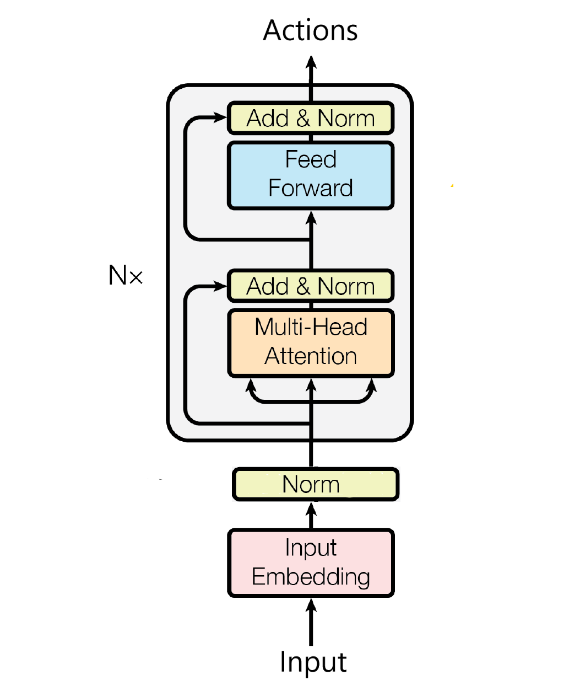
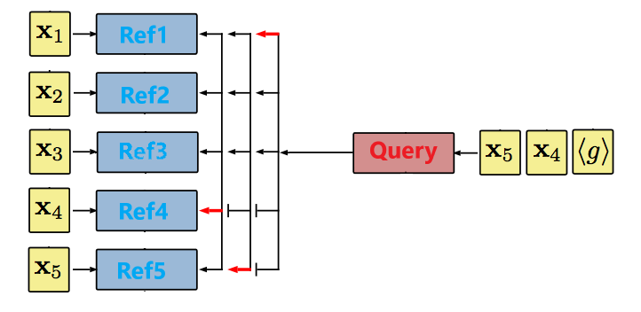
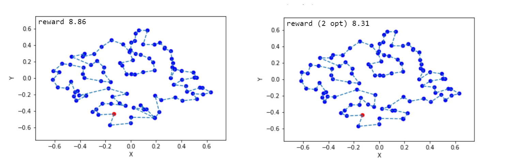
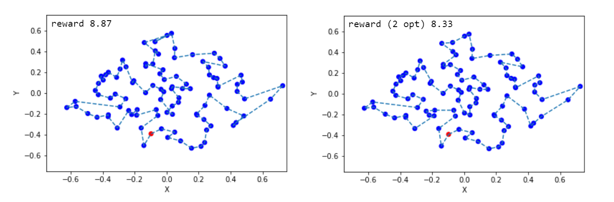

# Encode, Attend & Navigate

## Overview

Tensorflow implementation of "Learning Heuristics for the TSP by Policy Gradient". <br/>
[Michel Deudon, Pierre Cournut, Alexandre Lacoste, Yossiri Adulyasak, Louis-Martin Rousseau].

## Requirements

- [Python 3.5+](https://anaconda.org/anaconda/python)
- [TensorFlow 1.3.0+](https://www.tensorflow.org/install/)
- [Tqdm](https://pypi.python.org/pypi/tqdm)

## Usage

- To train a model from scratch (data is generated on the fly), run blocks 1.DataGenerator, 2.Config, 3.Model and 4.Train with the Jupyter Notebook (Neural_Reinforce.ipynb). You can change parameters in the Config block. Default parameters should replicate results reported in our paper (2D TSP50).

- If training is successful, the model will be saved in a "save" folder (filename depends on config) and training statistics will be reported in a "summary" folder. To visualize training on tensorboard, run:
```
> tensorboard --logdir=summary
```

- To test a trained model, run block 5.Test with the Jupyter Notebook (Neural_Reinforce.ipynb).

## What is Combinatorial Optimization ?


* __Combinatorial Optimization__: A topic that consists of finding an optimal object from a finite set of objects.
* __Sequencing problems__: The best order for performing a set of tasks must be determined.
* __Applications__: Manufacturing, routing, astrology, genetics...

Can we learn data-driven heuristics, competitive with existing man-engineered heuristics ?

## What is Deep Reinforcement Learning ?


* __Reinforcement Learning__: A general purpose framework for Decision Making in a scenario where a learner actively interacts with an environment to achieve a certain goal.
* __Deep Learning__: A general purpose framework for Representation Learning
* __Successful applications__: Playing games, navigating worlds, controlling physical systems and interacting with users.

## Related Work

Our work draws inspiration from [Neural Combinatorial Optimization with Reinforcement Learning](http://arxiv.org/abs/1611.09940) to solve the Euclidean TSP. Our framework gets a 5x speedup compared to the original framework, while achieving similar results in terms of optimality.

## Architecture

Following [Bello & al., 2016](http://arxiv.org/abs/1611.09940), our Neural Network overall parameterizes a stochastic policy over city permutations. Our model is trained by Policy Gradient ([Reinforce](https://link.springer.com/article/10.1007/BF00992696), 1992) to learn to assign high probability to "good tours", and low probability to "undesirable tours".

### Neural Encoder
  

  Our neural encoder takes inspiration from recent advances in [Neural Machine Translation](http://papers.nips.cc/paper/7181-attention-is-all-you-need)
  The purpose of our encoder is to obtain a representation for each action (city) given its context.

  The output of our encoder is a set of reference vectors ref = (enc1, ..., encn), each representing a city interacting with other cities. <br/><br/>

### Neural Decoder
  

  Similar to [Bello & al., 2016](http://arxiv.org/abs/1611.09940), our Neural Decoder uses a [Pointer](http://papers.nips.cc/paper/5866-pointer-networks) to effectively point to a city given a trajectory. Our model however explicity forgets after K steps, dispensing with LSTM networks. <br/><br/><br/>

### Local Search
We use a simple [2-OPT](https://en.wikipedia.org/wiki/2-opt) post-processing to clean best sampled tours during test time.
One contribution we would like to emphasize here is that simple heuristics can be used in conjunction with Deep Reinforcement Learning, shedding light on interesting hybridization between Artificial Intelligence (AI) & Operations Research (OR).

## Results





We evaluate on TSP100 our model pre-trained on TSP50 and the results show that that it performs relatively well even though the model was not trained directly on the same instance size as in [Bello & al, 2016](http://arxiv.org/abs/1611.09940). 

## Acknowledgments

- [Ecole Polytechnique](http://www.polytechnique.edu/), [Polytechnique Montreal](http://www.polymtl.ca/) and [CIRRELT](https://www.cirrelt.ca/) for financial and logistic support <br/>
- [Element AI](https://www.elementai.com/) for hosting weekly meetings <br/>
- [Compute Canada](https://www.computecanada.ca/), [Calcul Québec](http://www.calculquebec.ca/) & [Télécom Paris-Tech](https://www.telecom-paristech.org/) for computational resources <br/>

Special thanks (chronological order): <br/>
- [Pr. Louis-Martin Rousseau](http://hanalog.polymtl.ca/person/louis-martin-rousseau/) (Polytechnique Montreal), [Pr. Yossiri Adulyasak](http://www.yossiri.info/) (HEC Montreal) and [Dr. Alexandre Lacoste](https://twitter.com/recursix) (Element AI) who supervised this work and with who I had useful discussions and pleasant times. <br/>
- [Pierre Cournut](https://www.linkedin.com/in/pierre-cournut) (Ecole Polytechnique, KTH) with who I worked on the project. <br/>
- [Dr. Khalid Laaziri](https://www.gerad.ca/fr/people/khalid-laaziri), [Mehdi Taobane](http://cerc-datascience.polymtl.ca/person/mehdi-taobane/), Diane Bernier as well as MSc and PhD students from the "Pavillon André-Aisenstadt" for their kindness and support. <br/>
- [Pr. Claudia D'Ambrosio](https://www.lix.polytechnique.fr/~dambrosio/) and [Pr. Leo Liberti](https://www.lix.polytechnique.fr/~liberti/) (CNRS, LIX) for their feedback on the project. <br/>
- [Pr. Alessandro Lazaric](http://chercheurs.lille.inria.fr/~lazaric/Webpage/Home/Home.html) and [Pr. Matteo Pirotta](http://teopir.github.io/) (SequeL Team, INRIA Lille) for giving a course on Reinforcement Learning at ENS Cachan (M2 [Mathématiques, Vision, Apprentissage](http://math.ens-paris-saclay.fr/version-francaise/formations/master-mva/)) <br/>
- Magdalena Fuentes (Télécom Paris-Tech) for helping with Télécom's GPU support and setting up the required environment. <br/>

## Author
Michel Deudon / [@mdeudon](https://github.com/MichelDeudon)
